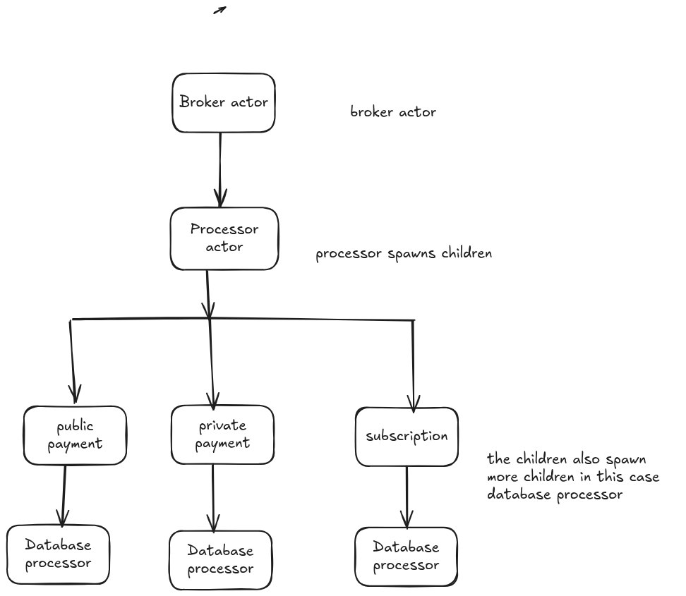

# Actor Payment System



This repository contains an implementation of a payment system using the Actor model architecture. The above diagram illustrates the system's components and their interactions.

## Running the Application

To run the program, follow these steps:

1. Open two terminal windows
2. In the first terminal, run:
    ```bash
    go run broker/main.go
    ```
3. In the second terminal, run:
    ```bash
    go run cmd/processor/main.go
    ```